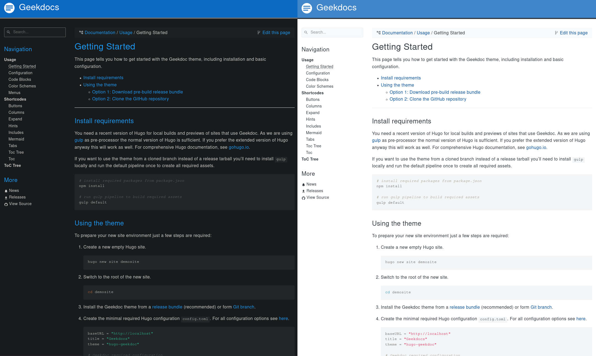

# Hugo Geekdocs Darkmode

Dark Color Scheme for Hugo-Geekdocs Theme (`custom.css`).

## Installation

1. Install [Geekdocs Theme](https://geekdocs.de/)
2. Add `custom.css` to `static` directory

## Demo

The picture shows on the left side the darkmode and on the right side the original look of Geekdocs.
